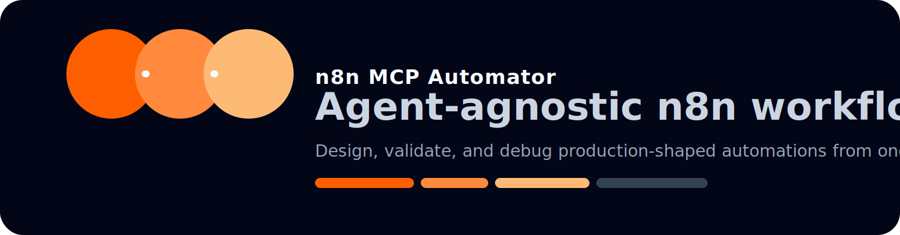

# Claude Code n8n MCP Automator

<p align="center">
  
</p>

`n8n-mcp-automator` is a Claude Code-first skill for turning prompts into production-shaped n8n workflows. It is still agent-agnostic under the hood and works for tools that can load local skill folders, including Codex, Warp, Antigravity, Gemini CLI, Cursor, OpenCode, and similar systems.

<p align="center">
  
  
  
  
</p>

<p align="center">
  
</p>

Use this skill when an agent needs to:

- design a new n8n workflow from a prompt
- repair broken node configs or expressions
- choose a workflow pattern before wiring nodes
- validate workflow JSON before activation or deployment
- work with the n8n MCP server or the community n8n-mcp toolset

## Best At

- recursive workflow repair
- expression debugging
- node configuration sanity checks
- production-shaped workflow planning
- keeping Claude Code useful without losing multi-agent portability

## What It Covers

- expression syntax and field mapping
- MCP tool selection and mode boundaries
- workflow pattern selection
- validation and error recovery
- recursive repair loops
- failure classification
- node configuration rules
- Code node JavaScript
- Code node Python

## Compatibility

| Agent | Common skill path | Notes |
| --- | --- | --- |
| Antigravity | `.agent/skills/` | Project-local skill path |
| Claude Code | `.claude/skills/` | Project-local skill path |
| Codex | `.codex/skills/` | Project-local skill path |
| Cursor | `.cursor/skills/` | Project-local skill path |
| Gemini CLI | `.gemini/skills/` | Project-local skill path |
| GitHub Copilot | `.github/skills/` | Project-local skill path |
| OpenCode | `.opencode/skills/` | Project-local skill path |
| Warp | `.warp/skills/` or agent-specific skill folders | Check the local skill path used by your setup |

## Install

Copy the folder into the skill directory your agent reads. For example:

```bash
SKILLS_DIR="${SKILLS_DIR:-$HOME/.codex/skills}" && mkdir -p "$SKILLS_DIR" && cp -R . "$SKILLS_DIR/n8n-mcp-automator"
```

If your agent uses a different local skill path, copy the folder there instead.

## Example Requests

- `Build a webhook -> Slack notification workflow`
- `Fix this n8n expression and explain why it broke`
- `Turn this API spec into an n8n workflow`
- `Validate this workflow JSON before I deploy it`
- `Create a scheduled content pipeline with retries and alerts`

## Repository Structure

- `SKILL.md` contains the workflow rules and trigger guidance
- `references/` contains the syntax, validation, and pattern guides
- `references/repair-loop.md` contains the recursive recovery loop
- `references/failure-modes.md` contains the failure taxonomy
- `assets/` contains small visual assets for the README
- `agents/openai.yaml` contains the skill metadata used by Codex-style tooling

## Related Sources

- [n8n MCP server docs](https://docs.n8n.io/advanced-ai/accessing-n8n-mcp-server/)
- [n8n AI Workflow Builder docs](https://docs.n8n.io/advanced-ai/ai-workflow-builder/)
- [n8n workflow docs](https://docs.n8n.io/workflows/)
- [n8n Code node docs](https://docs.n8n.io/code/code-node/)
- [community n8n-mcp toolset](https://github.com/czlonkowski/n8n-mcp)

## Contributing

- keep changes small and specific
- add a reference file only when it reduces repeated reasoning
- prefer explicit workflow rules over broad claims
- keep the skill agent-agnostic unless a rule is truly tool-specific

## Maintainer

X: [@mdayan24X](https://x.com/mdayan24X)

## License

MIT License.

## Safety Note

This repository can influence workflow automation, credentials handling, and deployment behavior. Review it before using it in production.
